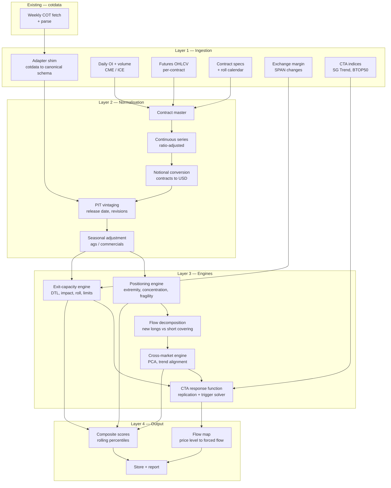

# crowdmon-futures — COT Positioning & Systematic Flow Model

**System description v0.1** · companion spec to `crowdmon_system_description.md` · Python

Written as a peer document rather than an appendix section, because on current priority this is the primary build and the equity monitor is the follow-on. The two share a store, an aggregation layer, a report layer, and most of the exit-capacity engine.

---

## 1. Purpose and rationale

Measure crowding and forced-exit risk in futures markets, and model the **systematic flow response function**: given a price or volatility move, how many contracts must trend-following and vol-targeting capital mechanically transact, and what does that cost in impact terms.

### Why futures first

COT resolves the four structural weaknesses of the 13F approach:

| Weakness in equities | Status in futures |
|---|---|
| Long-only — the short book is invisible | Long, short and spreading all reported explicitly |
| 45-day lag, quarterly | 3-day lag, weekly |
| Holdings estimated against an estimated float | Zero-sum closed system; open interest known exactly |
| No trader counts, no concentration data | Trader counts per category plus published CR4/CR8 |

Additionally, futures ADV is exact and public, which removes the softest input in the equity exit-capacity calculation, and systematic capital in futures is *replicable* — trend-following can be modelled to a decent fit, so the reflexivity model is buildable rather than hypothetical.

### Goals

| # | Goal |
|---|------|
| G1 | Ingest COT into a point-in-time, vintage-aware store, reusing existing `cotdata` infrastructure |
| G2 | Normalise positioning into risk units comparable across markets and across time |
| G3 | Separate positioning *extremity* from positioning *concentration* and holder *fragility* |
| G4 | Measure cross-market positioning alignment — the macro/CTA book as a single object |
| G5 | Compute exit capacity with futures-specific constraints (roll congestion, limit moves, margin) |
| G6 | Produce a flow map: price level → forced systematic flow → days of ADV → bps of impact |

### Non-goals

- Not a trend-following strategy. The CTA replication model exists to estimate *other people's* positions, and must not be repurposed as a signal without separate validation.
- No intraday data, no order-book modelling.
- No options positioning in v0.1 (futures-and-options-combined COT is ingested, but not delta-decomposed).
- No cash/OTC/swap market reconstruction.

---

## 2. Architecture



**Shared with the equity monitor:** store, aggregation/z-scoring, report layer, and the impact-cost core of the exit-capacity engine (§5 of the equity doc). **Distinct:** ingestion, contract master, positioning engine, CTA response function.

---

## 3. Data sources

| Source | Content | Cadence | Lag | Notes |
|---|---|---|---|---|
| CFTC COT — Legacy | Commercial / non-commercial / non-reportable | Weekly | 3d | Longest history; use for pre-2006 backfill |
| CFTC COT — Disaggregated | Producer-Merchant, Swap Dealer, Managed Money, Other Reportable | Weekly | 3d | Physical commodities; 2006+ |
| CFTC COT — TFF | Dealer, Asset Manager, Leveraged Funds, Other Reportable | Weekly | 3d | Financial futures (rates, FX, equity index) |
| CFTC concentration ratios | CR4 / CR8 gross and net, largest traders | Weekly | 3d | Published within the same files |
| Bank Participation Report | Bank positioning by market | Monthly | — | Useful cross-check in FX and rates |
| CIT Supplemental | Index trader positions, select ags | Weekly | 3d | Separates index flow from spec flow |
| Exchange daily OI + volume | Per-contract OI, volume | Daily | 1d | **Required** for nowcasting between COT releases |
| Futures OHLCV | Per-contract prices | Daily | 1d | Per-contract, not pre-stitched |
| Contract specifications | Multiplier, tick, currency, limits | Static | — | Manually maintained |
| Exchange margin | Initial/maintenance, SPAN changes | Event | — | Margin hikes are a mechanical deleveraging trigger |
| SG Trend / BTOP50 | CTA index returns | Daily/Monthly | Varies | Calibration target for §7 |

**Release mechanics:** COT publishes Friday 15:30 ET reflecting the prior **Tuesday** close. Both dates must be stored. Holiday weeks shift the schedule. Futures-only and futures-and-options-combined are separate series and must not be mixed within a time series.

---

## 4. Integration with existing `cotdata` infrastructure

Existing local infrastructure at `.../trading_workspace/cotdata` handles weekly COT consumption. The design assumption is **wrap, don't replace** — an adapter shim normalises whatever that module emits into a canonical schema, and everything downstream depends only on the schema.

### Canonical positioning schema

One row per market × report-type × category × vintage:

```
report_date        date    Tuesday as-of date
release_date       date    Friday publication date  -- index on this
vintage            int     0 = original, 1..n = revisions
market_code        str     CFTC contract market code
exchange           str
report_type        enum    legacy | disaggregated | tff
combined           bool    futures-only vs futures+options
category           str     e.g. managed_money, leveraged_funds
long_contracts     int
short_contracts    int
spread_contracts   int     null where not applicable
trader_count_long  int     null where suppressed
trader_count_short int
open_interest      int     total OI for the market/report
cr4_net_long       float   concentration ratios
cr4_net_short      float
cr8_net_long       float
cr8_net_short      float
```

### Adapter contract

```python
class CotSource(Protocol):
    def available_releases(self) -> list[date]: ...
    def load(self, release_date: date) -> pd.DataFrame:
        """Return rows conforming to the canonical schema above."""
```

Two implementations: `LocalCotData` wrapping the existing module, and `CftcApiCotData` as a fallback and for backfill. Validation on every load — schema conformance, `long + short + spread <= OI` sanity, non-null keys, category vocabulary check.

> **Amended 2026-07-30, the OI sanity check as written is wrong.** `long + short + spread
> <= OI` is not a bound on a single category row: the two sides of a market are counted
> separately, so a category holding 80k long and 294k short in a 383k-OI market sums to
> 374k with nothing wrong. Implemented literally it fired on 811 of 5,778 gold rows (14%).
>
> The invariant that does hold is **per side, summed across every category**, since every
> long contract in the market belongs to exactly one category: `Σ long <= OI` and
> `Σ short <= OI`. That is now what `vintage_ingest.validate` checks, and store-wide
> warnings went from thousands to zero.
>
> Stronger still, and free: **`Σ long == Σ short`**, because futures are closed and
> zero-sum. Verified on **149,412 / 149,412 weeks** across all 95 Legacy markets, 1986 to
> 2026. Exposed as `vintage_flow.zero_sum_check` and worth running on every adapter load,
> because a dropped, duplicated or misrouted category column breaks it on the first week.

*Open items to resolve at implementation:* the existing module's output schema and index conventions, whether history is already backfilled and from what date, and whether revisions are currently retained or overwritten. Revision retention is the one that matters most — see §5.3.

> **Resolved 2026-07-30** by the vintage build (branch `claude/cot-revision-snapshots-9b196f`,
> [PR #78](https://github.com/mspinola/cotdata/pull/78); spec + outcome in
> [cot_vintage_store_handoff.md](https://github.com/mspinola/cotdata/blob/main/docs/design/cot_vintage_store_handoff.md) §12, design in
> [cot_vintage.md](https://github.com/mspinola/cotdata/blob/main/docs/design/cot_vintage.md)):
>
> - **Output schema.** Wide, one parquet per symbol per report type, `Report_Date`-indexed
>   (tz-naive `DatetimeIndex`): OI, per-category long/short, trader counts. `Report_Date` is
>   stored exactly as reported and **never** normalised to Tuesday, so §5.3's holiday-week
>   hazard is already avoided by the existing producer.
> - **Backfill.** Full history per report: Legacy from 1986, Disaggregated and TFF from 2006.
> - **Revisions were overwritten**, as §5.3 feared: every run rebuilt the whole per-code table
>   and replaced the parquet, so no prior state survived. That is what the vintage layer fixes.
> - **`release_date` did not exist anywhere**, and could not simply be read — see §5.3.
> - **Only futures-only is fetched**, so `combined` is constant-`False` today: the column is
>   present and correct but not yet discriminating, and half the reportable universe is absent
>   until the combined files are added.
> - **On LEGACY only, `spread_contracts` is null and `NonComm_Positions_Spread_All` is not
>   captured at all.** It is absent from `providers/cftc.py`'s `TARGET_COLS`, so it never
>   reaches the stored parquet, the canonical rows, or any vintage observation. Measured as
>   the exact, equal gap between each side total and open interest: gold on 2026-07-21 had
>   OI 383,368 against 351,385 on both sides, a gap of 31,983 (8% of OI). Net positioning
>   is unaffected, since spreading is long and short in equal measure, but **anything
>   denominated as a share of open interest (§5.2 step 2) has a denominator containing
>   contracts its numerator cannot see.**
>   **Disaggregated and TFF do not have this defect** (canonicalisers added 2026-07-30):
>   both publish spreading per category, and the identity closes exactly, 7,847 of 7,847
>   Disaggregated weeks with an `oi_gap` of zero. Since the categories this document
>   actually uses are Disaggregated and TFF categories, §5.2 rung 2 is sound for them and
>   compromised only for Legacy.
> - **Trader counts and CR4/CR8 are populated for Disaggregated and TFF**, per category and
>   per market respectively, which is what §6.2's breadth-depth quadrant needs. They are
>   absent on Legacy. Trader counts carry `.` for a suppressed value and canonicalise to
>   null: on the 2026 Disaggregated file, 3,578 of 7,847 Managed Money long counts are
>   suppressed, so "null" is a routine and meaningful state, not a data error.
> - **`vintage: int` is not how it was built.** The implementation is bitemporal
>   (`observed_at` plus change-only rows), so a point-in-time read is "greatest
>   `observed_at <= t` per natural key". An integer vintage ordinal can be derived from that
>   if this adapter wants one, but it is not stored — storage grows with revisions rather
>   than with time, which an ordinal-per-week scheme would not achieve.

---

## 5. Normalisation

### 5.1 Contract master and continuous series

Per market: multiplier, currency, tick size, daily price limit rules, roll calendar, first notice date. Continuous series built ratio-adjusted (not difference-adjusted) so returns are correct, with the unadjusted per-contract series retained separately for notional and margin calculations.

### 5.2 Positioning in comparable units

The normalisation ladder, in increasing order of usefulness:

1. **Net contracts** — raw. Not comparable across time or markets. Do not report.
2. **Net / open interest** — positioning as share of the market. Handles secular OI growth.
3. **Net notional USD** = `net_contracts × multiplier × price`. Comparable across markets.
4. **Vol-scaled notional** = `net_notional × σ_daily`. Positioning expressed in risk units. This is the version that corresponds to what actually forces deleveraging, and should be the default for every cross-market comparison.

The widely used **COT Index** — stochastic rescaling of net position to 0–100 over a three-year window — is retained for continuity but flagged in output as lookback-sensitive and non-stationary. Rolling z-score of vol-scaled notional over a 3-year window is the primary measure.

### 5.3 Point-in-time discipline

Index on **release date**, never as-of date. Using the Tuesday date embeds a three-day lookahead — small, but it is exactly the window in which the largest moves happen, so it flatters every historical result in precisely the wrong way.

CFTC revises. Store vintages and expose an as-of query so backtests see only what was visible at the time. If the existing `cotdata` module overwrites on re-fetch, this is the first thing to change.

> **Built 2026-07-30.** It did overwrite; `cotdata-vintage` now captures as-published
> snapshots, records field-level revisions with `age_days` depth, and answers
> `asof(t)`. Two findings change what this section can assume:
>
> - **Release date is resolved, not read.** The annual zips carry only `report_date`, and
>   HTTP headers cannot recover historical publication times (see
>   [handoff §12.1](https://github.com/mspinola/cotdata/blob/main/docs/design/cot_vintage_store_handoff.md) — a measured negative result). So
>   `release_date` carries a provenance flag,
>   `published > observed > announced > scheduled > derived`. **`derived` fails on exactly
>   the weeks that matter** (holiday shifts, the Oct–Dec 2025 backlog), so anything doing
>   strict point-in-time evaluation must be able to exclude `derived` rows rather than
>   trusting the date. A release date without provenance is worse than none.
> - **Vintages accumulate forward only.** Git archaeology recovered nothing and CFTC serves
>   current state only, so the vintage series begins at first capture. Backtests over
>   history predating that see *current-state* data with no as-of protection — the PIT
>   discipline this section asks for is available going forward, not retroactively. That is
>   a permanent property, not a gap to be filled later.

### 5.4 Seasonal adjustment

Commercial and producer-merchant positioning in agricultural markets is strongly seasonal — hedging follows the crop calendar, not sentiment. Raw z-scores on those categories are dominated by seasonality and will produce spurious extremes every year at the same time. Apply a seasonal decomposition (or compare year-over-year within week-of-year) before z-scoring commercial categories in ags. Managed Money is less affected but not immune.

---

## 6. Positioning engine

### 6.1 Extremity

Rolling z-score and percentile of vol-scaled net notional, per market per category, 3-year window, winsorised. Reported as percentile against own history.

### 6.2 Concentration and breadth

The metric set that COT gives away free and that has no cheap equity equivalent:

- **CR4 / CR8** net long and short — published directly
- **Trader counts** per category and side
- **Average position per trader** = net position / trader count
- **Breadth–depth quadrant**, the key derived view:

| | Trader count rising | Trader count flat/falling |
|---|---|---|
| **Avg position rising** | Crowd broadening *and* levering. Most dangerous. | Narrow and deep. Existing holders levering into it. Violent unwind. |
| **Avg position flat/falling** | Crowd broadening, individually smaller. Wide and shallow. Grinds. | Position being distributed. Crowding easing. |

Same net position can sit in any quadrant. The quadrant, not the net, predicts the character of the unwind.

### 6.3 Holder fragility

The conceptually important adjustment, and the one most COT analysis omits. Futures are zero-sum — every long is matched by a short, so "everyone is long" is impossible and net imbalance alone says little. What matters is **how much of the open interest sits with holders who face forced-exit functions**.

Assign a constraint weight per category:

| Category | Weight | Rationale |
|---|---|---|
| Managed Money / Leveraged Funds | 1.0 | Vol targets, margin, drawdown limits, monthly redemptions |
| Other Reportables | 0.5 | Mixed |
| Dealer / Intermediary | 0.4 | Hedged, but balance-sheet constrained |
| Asset Manager / Institutional | 0.3 | Unlevered, longer horizon |
| Producer / Merchant / Processor | 0.1 | Hedging physical; can stand for delivery |
| Non-reportable | 0.6 | Retail; small but least resilient per unit |

`fragility_weighted_oi = Σ (category_position × weight) / open_interest`

Weights are configured, documented as judgement, and subjected to sensitivity analysis rather than presented as estimates.

**The table above is the CONCEPTUAL one. `src/crowdmon/core/config.py` holds the live
values**, and where the two differ the code is what runs: `managed_money: 1.0`, `swap: 0.4`,
`other_reportable: 0.5`, `nonreportable: 0.6`, `producer_merchant: 0.1` on Disaggregated, and
`leveraged: 1.0`, `dealer: 0.4`, `asset_manager: 0.3` on TFF. Quote `config.py` when the
number matters.

#### Weights are STATIC, and the spread across weight tables is a reported band

**Decision, taken 2026-08-03 and recorded so it is not reopened.** The weights do not become
regime-conditional. The evidence that raised the question is real: measured against Managed
Money at 1.0, the swap book sits at **0.305 on routine turnover and 0.067 in the worst 5% of
weeks** (`docs/analysis/2026-08-03-index-share.md` §5), so a single `swap: 0.4` is incoherent
**between regimes rather than between markets**, which is the opposite of the per-market
direction that work set out to explore.

A regime-switching table was rejected anyway, on cost rather than on the evidence. It needs a
stress classifier that is point-in-time and free of lookahead, and every misclassification
would propagate into `Q_sell`, `Q_buy`, `Phi` and the composite at once. The alternative is
cheaper and more honest: **report the output under several weight tables and treat the spread
as an uncertainty band rather than as noise.**

The band is `w_SD ∈ {0.067, 0.2, 0.4, 0.7}`. Three are round numbers chosen for spacing and
should be labelled as such; **0.067 is measured** and is therefore the empirically motivated
lower bound rather than a fourth round number. Three findings from running it
(`2026-08-03 §C6-C8`, reproducer
`docs/analysis/reproduce_template_stability.py::c6_the_reported_band` onward):

- **The band is not on one scale.** At 0.067 the swap weight drops below `producer_merchant`
  at 0.1 and becomes the table's minimum, so the ceiling above rises from 10.0 to 14.925.
  Scale a ratio by its own ceiling before comparing across the band.
- **`w_SD = 0.4` overstates fragile capital, and worst where it is least deserved.** `Phi` at
  0.4 exceeds `Phi` at 0.067 on 99.31% of market-weeks and never falls below it, by a median
  +19.6%. Per market the inflation runs +0.9% (rough rice) to +50.8% (Henry Hub), and **gold
  at +27.8% is affected 2.30x as much as cocoa at +12.1%**, because on gold the swap dealer
  is the immovable physical-hedging side while on cocoa it holds the largest net long.
- **Most of that never reaches the composite**, which consumes `pct(Phi)` rather than `Phi`:
  the median percentile shift is 0.0588. But 9.79% of market-weeks shift more than 0.25, and
  on **98 of 264 markets** the two weight tables order that market's own weeks differently.
  Publish the band beside a `D` percentile on power and gas basis; on a classic outright it
  is a footnote.

**What `swap` should actually BE is a separate, open question and is the human's**, filed as
`docs/handoffs/2026-08-03-swap-dealer-weight-decision.md`. This decision closes that
handoff's option (c) and leaves (a), (b) and (d) open. No weight value changed here.

#### The weight table sets the range of every asymmetry metric before any data arrives

Since `Σ_c P_c = 0`, the gross net-long total `G` equals the gross net-short total. Therefore
`Q_sell ≤ max(w)·G` and `Q_buy ≥ min(w)·G`, so **any ratio of the two directions is bounded**:

```
Q_sell / Q_buy   ≤   max(w) / min(w)
```

and the direction-agnostic form `max(Q_sell, Q_buy) / min(Q_sell, Q_buy)` carries the same
bound. The current ceilings are **10.0 on Disaggregated** (1.0 / 0.1) and **3.333 on TFF**
(1.0 / 0.3), verified at zero breaches across 21,756 Disaggregated and 6,033 TFF
market-weeks.

Three consequences, none of which were visible when this section was written:

- The ceiling is a property of `core/config.py`, not of any market. An observed ratio must be
  quoted **alongside the ceiling** or as a fraction of it, or it reads as a free measurement
  when it is partly a statement about the config.
- Changing the weight spread **rescales every asymmetry figure**, so a cross-version
  comparison requires the weight-table version to be recorded beside the result. Changing the
  *level* of the weights uniformly does not, because it cancels in the ratio.
- The two report types **cannot be compared**, for the same reason §2.3 of the TFF analysis
  gives for Φ itself: the ceilings differ by a factor of three, so the appendix's 9.05×
  example is arithmetically unreachable on TFF rather than merely unusual there.

Measured: see amendments 2026-08-02 §B31 (the bound and its verification), §B32 (per report
type) and §B34 (the direction-agnostic form, and why the *signed* median of 0.993 is
direction cancelling rather than symmetry).

#### `PM == 0` is inexpressible, not false

When labelling a market by the hedger-versus-fund shape, a market with **no
Producer/Merchant position at all** is a sixth outcome and must be labelled explicitly. It is
not "the fund is flat", and it is not "the template does not hold": there is no hedger side
for the template to be a statement about.

It is 73 of 21,756 Disaggregated market-weeks, concentrated in the retail-sized contracts
(MICRO GOLD in 58 weeks of 80, MICRO SILVER 5, Coinbase GOLD-1oz 4), and on TFF it is a third
of the report by market count, because `asset_manager` is absent from crypto in 72.7% of
market-weeks.

**Label by explicit mask, never by fall-through.** A first implementation defaulted unmatched
rows to "fund net flat" and duly reported MICRO GOLD as a fund-flat market, when Managed Money
is net long there in 84% of weeks and it is the *hedger* that is missing. Recorded here so it
is not re-introduced; asserted in `tests/test_fragility.py`.

### 6.4 Flow decomposition

Weekly change in net position decomposes into four states, which have different implications:

| ΔLong | ΔShort | State | Implication |
|---|---|---|---|
| + | ~0 | New longs | Fresh conviction buying. Sustainable while flows continue. |
| ~0 | − | Short covering | Rally with a **finite fuel supply**. Ends when the shorts are gone. |
| ~0 | + | New shorts | Fresh bearish conviction. |
| − | ~0 | Long liquidation | Position exit, not fresh selling. |

A rally driven by short covering and a rally driven by new longs look identical on a chart and are entirely different setups. This decomposition is one line of code and is among the highest-value outputs in the system.

> **Built 2026-07-30** as `cotdata/vintage_flow.py` (`cotdata-vintage flow`), directly on
> the canonical schema with no prices and no contract master. It lives in `cotdata` as a
> read-side function that writes no store domain and changes no producer/consumer contract;
> the positioning ENGINE stays here in crowdmon, because that one needs prices, a contract
> master and configured weights. Three things the table above does not say, all of which
> only appear against real data:
>
> - **"~0" never happens.** Both legs always move. Resolved by DOMINANT LEG: whichever of
>   |ΔLong|, |ΔShort| is larger names the state and its sign gives the direction, exact
>   ties to the long leg. Parameter-free, so nothing to tune and nothing to overfit. An
>   optional `min_frac_oi` dead zone adds a `quiet` state and defaults to 0.0, since any
>   other value is a judgement of the same kind as §6.3's fragility weights.
> - **Open interest corroborates the label, and disagrees often enough to matter.** Fresh
>   positioning should create contracts and exits should destroy them; where it does not,
>   the label describes a transfer between categories rather than new or closed risk.
>   Emitted as `oi_corroborates` rather than folded into the state, because open interest
>   here is the market total (that is what CFTC reports), so it checks a per-category label
>   against a market-level quantity.
> - **The weekly change is not always weekly. COT was FORTNIGHTLY until 1992-10-13.**
>   Across the store 415,908 of 447,951 intervals are 7 days; the 14 and 15-day intervals
>   are almost all pre-October-1992, and the rest are holiday shifts. `days_elapsed` is
>   emitted as a column so a caller filters on it instead of discovering it in a result.
>   This is §5.3's holiday hazard showing up in a second place: not just in the release
>   date, but in the differencing interval.
>
> Worked example, gold non-commercial, week ending 2026-06-02: Δnet was **+21,760**, which
> reads as heavy fresh buying. The decomposition says ΔShort **-16,368** against ΔLong
> +5,392 with open interest **down 27,437**: short covering, a rally with a finite fuel
> supply. That is the distinction this section exists to make, on the first real week
> anyone looked at.

---

## 7. Cross-market engine

Five categories cannot yield a manager-to-manager overlap matrix. The substitute is stronger in one respect: you can observe whether the same category is positioned consistently *across correlated markets*, which is the thing crowding actually consists of.

- **Panel construction.** Matrix of z-scored Managed Money / Leveraged Funds positioning: markets × weeks.
- **Macro-book PCA.** PCA on positioning *changes*. PC1 approximates the aggregate systematic book; its variance share is the futures absorption ratio. Loading rotation indicates the book being redefined.
- **Trend alignment score.** Correlate the cross-market positioning vector against a canonical time-series momentum vector (blended 20/60/250-day TSMOM per market). High alignment means the trend book is fully expressed — little dry powder, maximum vulnerability to reversal. This is the futures analogue of the equity unwind mirror, and it is cleaner because trend-following is genuinely replicable.
- **Correlation clustering.** Cluster markets by return correlation rather than by sector label. "Long energy" and "short JPY" can be the same macro trade in a given regime; sector taxonomy hides that, empirical clustering does not.

---

## 8. Exit-capacity engine (futures)

The core impact model is shared with the equity spec (§5.2 there — square-root law, `impact ≈ Y·σ·√(Q/ADV)`). Futures-specific additions:

- **Days-to-liquidate** with exact ADV: `net_position / (participation × ADV_contracts)`. No float estimation required.
- **OI / volume ratio** — how many days of turnover the open interest represents. A structural liquidity descriptor.
- **Roll congestion.** Calendar spread volatility and bid-ask behaviour during roll windows, plus OI migration rate front→next. A crowded position that must roll pays a measurable, predictable tax; congestion in the spread is an early liquidity tell that the outright market does not show.
- **Limit moves.** Ags and some energy contracts have daily price limits. When limit-up or limit-down, available liquidity is *zero* — a hard constraint with no equity equivalent. Model as an absolute cap on daily exit volume, and flag markets currently near limit distance.
- **Margin sensitivity.** Exchange margin increases force deleveraging directly and are typically announced during vol spikes, i.e. exactly when exit capacity is already impaired. Track margin-to-notional and its change; a rising ratio into a crowded position is a scheduled unwind.
- **Stress-conditioned ADV** and the **volume-spike trap** mitigation carry over unchanged from the equity spec §5.4, and matter just as much here.

---

## 9. CTA response function

The centrepiece, and the reason futures is worth building first.

### 9.1 Replication model

Estimate aggregate systematic positioning per market as:

```
raw_signal_i   = blend of TSMOM over {20, 60, 250}d, squashed (tanh or rank)
vol_target_i   = target_vol / σ_i                    -- position ∝ 1/σ
portfolio_scale = f(correlation matrix, portfolio vol target)
position_i     = raw_signal_i × vol_target_i × portfolio_scale × AUM_estimate
```

The volatility-targeting term is the important one. Position size scales inversely with realised volatility, which means **a volatility spike forces selling regardless of price direction**. Most of the reflexivity in modern futures markets runs through this channel rather than through signal flips.

### 9.2 Calibration

Fit against two targets:

1. **SG Trend / BTOP50 returns** — regress modelled portfolio returns on index returns; target R² in the 0.6–0.8 range, which is what published replication work achieves.
2. **COT Managed Money positions** — the model should reproduce the observed weekly positioning panel. Fit quality per market tells you where the category is dominated by trend followers and where it is contaminated by discretionary macro.

Cross-validate the two. Where they disagree, COT is the ground truth for positioning and the index is the ground truth for aggregate risk appetite.

### 9.3 Trigger solver

Invert the model: for each market, solve for the price at which the blended signal changes sign, and for the volatility level at which vol targeting forces a given percentage reduction. Output:

```
market: GC (Gold)
current MM net:        +XXX,XXX contracts  (94th pctile, 3y)
fragility-weighted OI: 0.61
20d signal flips at:   $X,XXX  (−4.2% from spot)
60d signal flips at:   $X,XXX  (−9.8% from spot)
est. systematic supply on 60d flip: N contracts = M days ADV at 20% participation
est. impact:           P bps
vol-shock sensitivity: +5 vol pts forces −Q% position, independent of price
```

That block is the deliverable. It combines positioning extremity, holder fragility, a specific trigger level, and a liquidity-denominated cost estimate — which is the full synthesis the equity monitor can only approximate.

### 9.4 Standing caution

The replication model must not become a trading signal by drift. It is calibrated to reproduce *consensus* positioning, so trading it directly means deliberately joining the crowded trade the system exists to warn about. If a directional strategy is ever derived from it, that requires separate out-of-sample validation and its own document.

---

## 10. Validation

Replay against episodes where positioning is known to have driven the move, and require the composite to elevate **before** the drawdown rather than coincidentally with it:

| Episode | Test |
|---|---|
| Feb 2018 volatility spike | Vol-target channel: forced selling on σ, not price |
| Mar 2020 | Margin-driven deleveraging, limit moves, liquidity collapse |
| Aug 2024 yen carry unwind | Cross-market alignment; FX positioning extremity |
| 2021 ags / lumber | Limit-move constraint; seasonal adjustment correctness |
| Silver 2021 / gold 2025 | Retail and non-reportable participation, concentration ratios |

Plus mechanical tests: release-date indexing (no lookahead), vintage replay reproducing historical values exactly, and seasonal adjustment removing the annual cycle in ag commercial z-scores.

---

## 11. What this system does not measure

1. **Entities.** Five categories, not managers. No overlap matrix, no manager-level concentration.
2. **Category heterogeneity.** Managed Money blends CTAs, discretionary macro, and risk parity. Leveraged Funds in TFF includes relative-value books whose "net" is meaningless in isolation.
3. **Cash, OTC and swap exposure.** Partially visible through Swap Dealer and Dealer/Intermediary categories, but not decomposable. Commercial hedgers are offsetting physical positions you cannot see, which is why treating commercials as a sentiment signal is unsound.
4. **Options.** Combined reports include options on a futures-equivalent basis with no delta decomposition. Dealer gamma is not modelled.
5. **Intra-week dynamics.** Tuesday snapshot with Friday release. A fast unwind lasts days, so COT confirms after the fact — hence the daily OI nowcast, which is a partial fix and not a complete one.
6. **Non-US venues.** Positioning in LME, SGX, and Asian exchanges is not covered by CFTC reporting.
7. **Direction.** Positioning extremes persist for quarters. Every output is a statement about tail shape and forced-flow risk, not about next week's return.
8. **Whether a swap book is index flow or levered flow, outside 13 agricultural markets.** The CFTC Supplemental (Commodity Index Trader) report is the only public source that separates index positioning, and it covers **13 agricultural markets and no metals**. Gold, silver and copper are outside it and always will be. That is not a gap waiting on ingestion: cotdata#96 landed the report in full and the coverage is the report's own. It matters because **gold is the case that motivated half the Swap Dealer weight question**, the market where the swap dealer sits on the *immovable* physical-hedging side with Producer/Merchant at a tenth of the swap book (`2026-08-03 §C7`: gold is 2.30x more distorted by `w_SD` than cocoa). Anything established for ag transfers to metals only with an argument that is not in this data. Two further constraints on any cross-report attempt, both measured rather than assumed: Supplemental **Index Traders does not nest inside** Disaggregated **Swap Dealer** (Legacy taxonomy, not Disaggregated, so the two cannot be differenced), and the Supplemental is **futures-and-options combined** where the other three reports are futures-only, so a share computed across them needs a denominator from the same report. See `cotdata/docs/analysis/2026-08-03-cit-supplemental-measurements.md`.

---

## 12. Stack and layout

Python 3.11+ · polars or pandas · numpy · statsmodels · scikit-learn · scipy (trigger solver) · requests · pyarrow · duckdb · matplotlib · pydantic · pytest

```
crowdmon_futures/
  config/          markets.yaml, contract specs, fragility weights, params
  ingest/
    cot_adapter.py     wraps existing cotdata; canonical schema
    cftc_api.py        fallback + backfill
    exchange_oi.py     daily OI/volume nowcast feed
    prices.py          per-contract OHLCV
    margin.py          SPAN margin changes
  normalize/
    contract_master.py
    continuous.py      ratio-adjusted stitching
    notional.py
    vintage.py         PIT store, revision handling
    seasonal.py
  engines/
    positioning.py     extremity, concentration, fragility, flow decomposition
    crossmarket.py     panel, PCA, trend alignment, clustering
    liquidity.py       DTL, roll congestion, limit moves, impact
    cta.py             replication, calibration, trigger solver
  aggregate/
  report/            flow map, quadrant plots, panel heatmaps
  store/             shared duckdb with equity monitor
  tests/
  cli.py
```

---

## 13. Build order

1. **Adapter + canonical schema + vintage store.** Wrap `cotdata`, backfill history, enforce release-date indexing. Nothing downstream is trustworthy until this is right.
2. **Contract master, notional and vol-scaled normalisation.** Everything else consumes these units.
3. **Positioning engine** — extremity, concentration, breadth–depth quadrant, flow decomposition. First genuinely useful output; earns its keep before any modelling.
4. **Exit-capacity engine** — DTL, impact, limit-move and roll constraints.
5. **Cross-market engine** — panel, PCA, trend alignment.
6. **CTA response function and trigger solver.** Highest value, highest complexity; depends on all of the above.
7. Validation replay, report layer, seasonal adjustment for ags.

Steps 1–3 constitute a working monitor on their own. Steps 4–6 are what make it a forced-flow model rather than a positioning dashboard.
